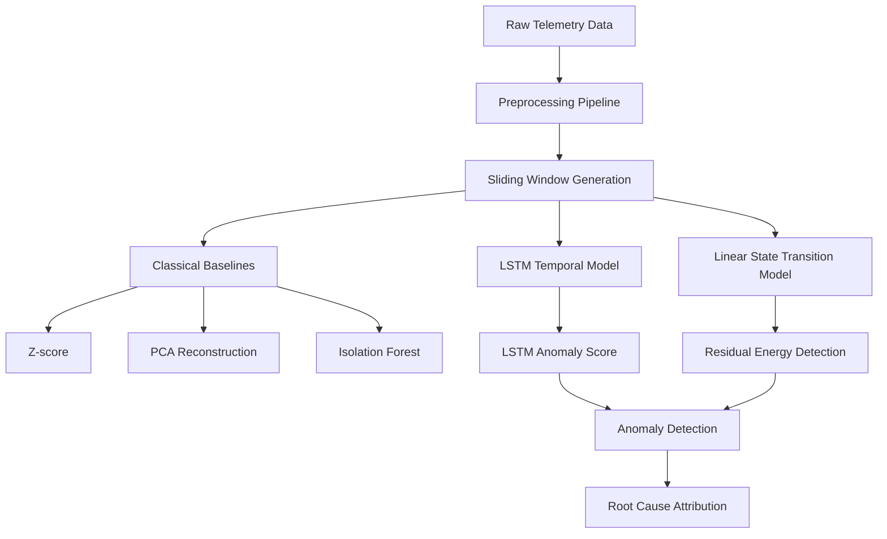

# Hybrid Telemetry Anomaly Detection with Root Cause Attribution

This project investigates anomaly detection in multivariate spacecraft telemetry using a hybrid approach that combines data-driven temporal models with a linear dynamical system.

An LSTM model is used to learn normal temporal behavior in telemetry sequences, while a linear state transition model captures deviations from expected system dynamics through innovation residuals.

The goal is to detect abnormal system behavior in unlabeled telemetry streams and identify which sensors contribute most to anomalous transitions.
## Pipeline Overview


## Dataset

The experiments use the NASA spacecraft telemetry dataset (SMAP / MSL).

The dataset contains multivariate time-series signals collected from spacecraft subsystems.  
Each channel represents a telemetry sensor recording system behavior over time.

Dataset reference: NASA SMAP / MSL telemetry anomaly detection benchmark.


---

## Project Pipeline

The project follows a step-by-step modeling workflow.

### 1. Telemetry Exploration

Initial inspection of raw telemetry channels:

- identify inactive or low-variance sensors  
- inspect temporal patterns  
- observe subsystem behavior across different channels  


### 2. Preprocessing Pipeline

Telemetry sequences are prepared for modeling:

- removal of constant sensors  
- chronological train / validation / test split  
- normalization using training statistics only  
- sliding window generation for temporal models  


### 3. Classical Baseline Models

Several standard anomaly detection methods are evaluated:

- Z-score anomaly detection  
- PCA reconstruction error  
- Isolation Forest  

These baselines help understand the limits of purely statistical approaches.


### 4. Self-Supervised LSTM Temporal Model

A sequence model is trained to learn normal system behavior.

The model is trained using two objectives:

- sequence reconstruction  
- next-step prediction  

Anomaly scores are derived from reconstruction and prediction error.


### 5. Linear Dynamical System Model

A simple linear state transition model is estimated using system identification:

x(t+1) = A x(t)

Innovation residual energy is used as a physics-inspired anomaly signal.


### 6. Root Cause Attribution

Residual energy is decomposed into per-sensor contributions.

This enables ranking sensors by their contribution to anomalous transitions and allows interpretable fault localization.


---

## Key Idea

Different detectors capture different aspects of system behavior.

- Statistical methods capture distribution shifts  
- LSTM models capture nonlinear temporal dynamics  
- Linear dynamical models capture deviations from system transition structure  

Combining these perspectives provides a richer understanding of anomalies in telemetry data.


---
## Repository Structure

```
notebooks/
│
├── 01_telemetry_exploration.ipynb
├── 02_preprocessing_pipeline.ipynb
├── 03_classical_baselines.ipynb
├── 04_lstm_temporal_model.ipynb
├── 05_linear_state_model.ipynb
└── 06_root_cause_analysis.ipynb

data/
│
├── processed telemetry windows
└── saved model outputs
```

## Technologies Used

- Python  
- NumPy / Pandas  
- PyTorch  
- Scikit-learn  
- Matplotlib  


---

## Future Work

Potential improvements:

- hybrid fusion of LSTM and linear residual signals  
- more advanced system identification models  
- online anomaly detection for streaming telemetry  
- automated subsystem-level root cause analysis  


---

## Author

Yuvan Ashrith  
Osmania University College of Engineering
---

## License

This project is licensed under the MIT License. See the LICENSE file for details.